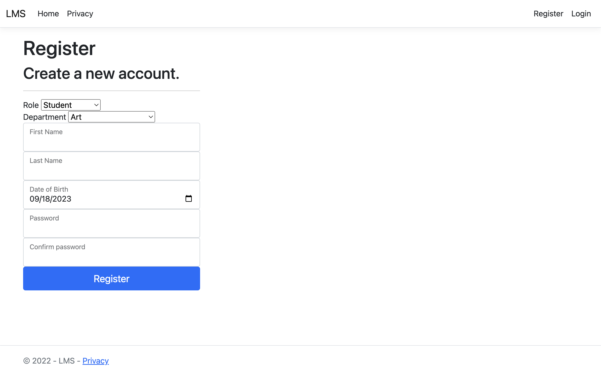

# Learning Management System (LMS)

#### Muyuan Zhang

## Features

* Implemented a dashboard for tracking students, teachers, and records in school like Canvas.
* Backend: Designed ER diagram and created SQL tables. Developed controller functions by Scaffolding and LINQ.
* Frontend: Implemented different roles' specific pages (e.g., courses, departments) and communicated with servers by AJAX.

## Screenshot

